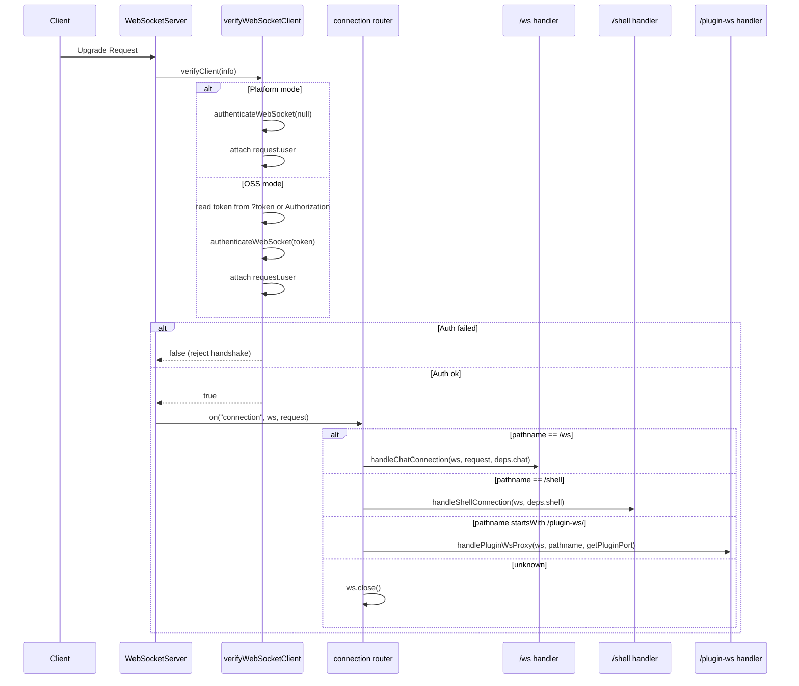
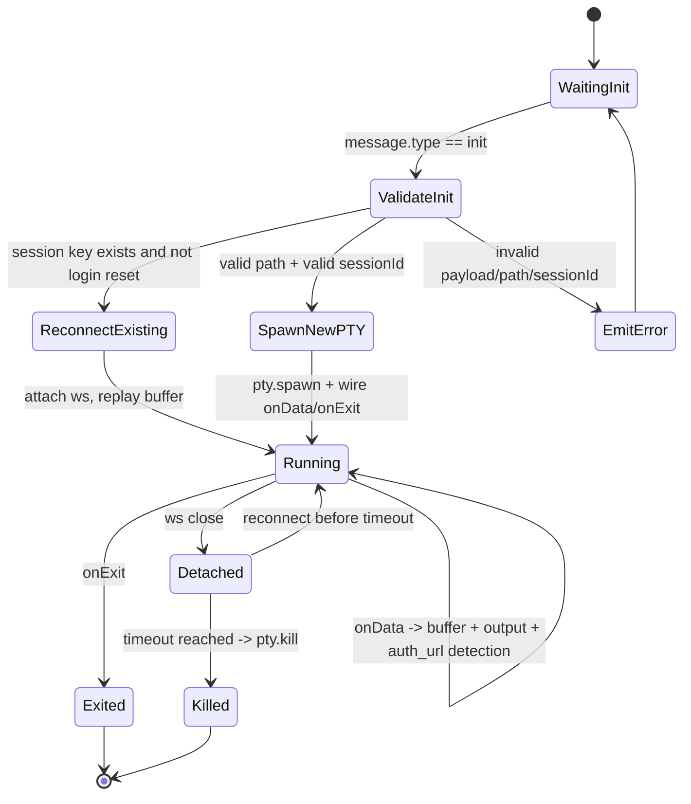
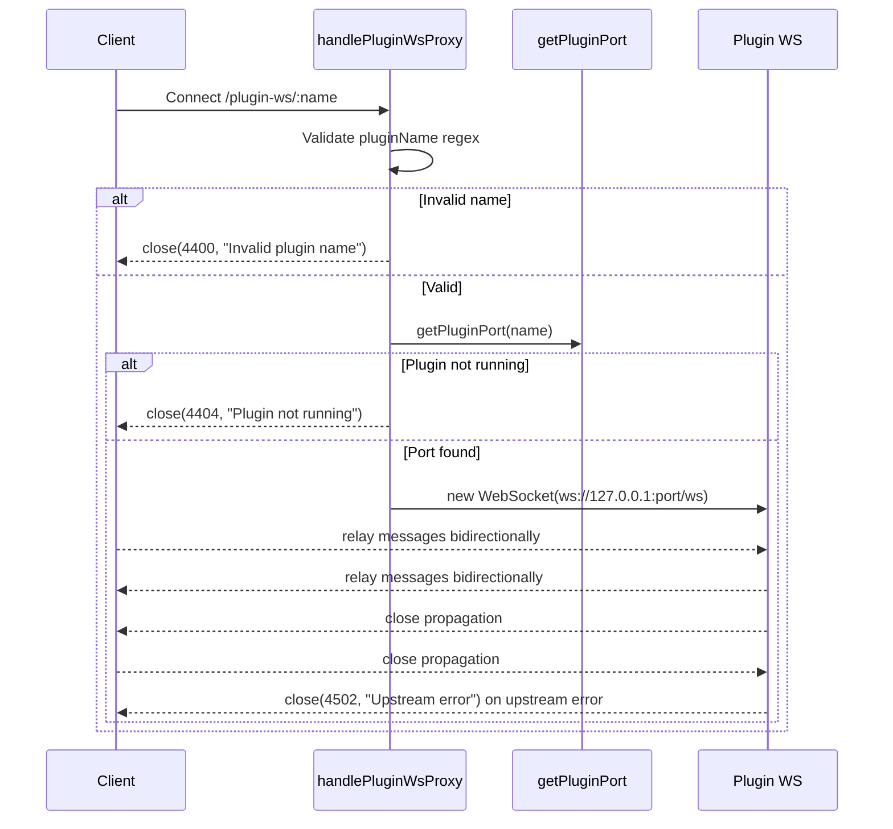

# WebSocket Module

This module owns the server-side WebSocket gateway used by:

1. Chat streaming (`/ws`)
2. Interactive terminal sessions (`/shell`)
3. Plugin WebSocket passthrough (`/plugin-ws/:pluginName`)

It is intentionally structured as **small services** plus a **barrel export** in `index.ts`.

## Public API

`server/modules/websocket/index.ts` exports:

1. `createWebSocketServer(server, dependencies)`  
Creates and wires the shared `ws` server.
2. `connectedClients` and `WS_OPEN_STATE`  
Shared chat client registry and open-state constant used by other modules.

## Why Dependency Injection Is Used

The module receives runtime-specific functions from `server/index.js` instead of importing legacy runtime files directly.

Benefits:

1. Keeps module boundaries clean (`server/modules/*` architecture rule).
2. Makes each service easier to test in isolation.
3. Keeps WebSocket transport concerns separate from provider runtime concerns.

## Service Map

| File | Responsibility |
|---|---|
| `services/websocket-server.service.ts` | Creates `WebSocketServer`, binds `verifyClient`, routes connection by pathname |
| `services/websocket-auth.service.ts` | Authenticates upgrade requests and attaches `request.user` |
| `services/chat-websocket.service.ts` | Handles `/ws` chat protocol and provider command/session control messages |
| `services/shell-websocket.service.ts` | Handles `/shell` PTY lifecycle, reconnect buffering, auth URL detection |
| `services/plugin-websocket-proxy.service.ts` | Bridges client socket to plugin socket |
| `services/websocket-writer.service.ts` | Adapts raw WebSocket to writer interface (`send`, `setSessionId`, `getSessionId`) |
| `services/websocket-state.service.ts` | Holds shared chat client set and open-state constant |

## High-Level Architecture

```mermaid
flowchart LR
  A[HTTP Server] --> B[createWebSocketServer]
  B --> C[verifyWebSocketClient]
  B --> D{Pathname}
  D -->|/ws| E[handleChatConnection]
  D -->|/shell| F[handleShellConnection]
  D -->|/plugin-ws/:name| G[handlePluginWsProxy]
  D -->|other| H[close()]

  E --> I[connectedClients Set]
  E --> J[WebSocketWriter]
  F --> K[ptySessionsMap]
  G --> L[Upstream Plugin ws://127.0.0.1:port/ws]

  I --> M[projects.service broadcastProgress]
  I --> N[sessions-watcher.service projects_updated]
```

## Connection Handshake + Routing



## `/ws` Chat Flow

When a chat socket connects:

1. Add socket to `connectedClients`.
2. Build `WebSocketWriter` (captures `userId` from authenticated request).
3. Parse each incoming message with `parseIncomingJsonObject`.
4. Dispatch by `data.type`.
5. On close, remove socket from `connectedClients`.

### Chat Message Dispatch

```mermaid
flowchart TD
  A[Incoming WS message] --> B[parseIncomingJsonObject]
  B -->|invalid| C[send {type:error}]
  B -->|ok| D{data.type}

  D -->|claude-command| E[queryClaudeSDK]
  D -->|cursor-command| F[spawnCursor]
  D -->|codex-command| G[queryCodex]
  D -->|gemini-command| H[spawnGemini]
  D -->|cursor-resume| I[spawnCursor resume]
  D -->|abort-session| J[abort by provider]
  D -->|claude-permission-response| K[resolveToolApproval]
  D -->|cursor-abort| L[abortCursorSession]
  D -->|check-session-status| M[is*SessionActive + optional reconnectSessionWriter]
  D -->|get-pending-permissions| N[getPendingApprovalsForSession]
  D -->|get-active-sessions| O[getActive*Sessions]
```

### Chat Notes

1. `abort-session` returns a normalized `complete` message with `aborted: true`.
2. `check-session-status` returns `{ type: "session-status", isProcessing }`.
3. Claude status checks can reconnect output stream to the new socket via `reconnectSessionWriter`.

## `/shell` Terminal Flow

The shell handler manages persistent PTY sessions keyed by:

`<projectPath>_<sessionIdOrDefault>[_cmd_<hash>]`

This enables reconnect behavior and isolates command-specific plain-shell sessions.

### Shell Lifecycle



### Shell Behaviors in Detail

1. `init`:
Reads `projectPath`, `sessionId`, `provider`, `hasSession`, `initialCommand`, `isPlainShell`.
2. Login reset:
For login-like commands, existing keyed PTY session is killed and recreated.
3. Validation:
Path must exist and be a directory; `sessionId` must match safe pattern.
4. Command build:
Provider-specific command construction with resume semantics.
5. PTY output buffering:
Stores up to 5000 chunks for replay on reconnect.
6. URL detection:
Strips ANSI, accumulates text buffer, extracts URLs, emits `auth_url` once per normalized URL, supports `autoOpen`.
7. Close behavior:
Socket disconnect does not instantly kill PTY; session is kept alive and terminated on timeout.

## `/plugin-ws/:pluginName` Proxy Flow



## Shared Client Registry and Broadcasts

Only chat sockets (`/ws`) are tracked in `connectedClients`.

That shared set is consumed by:

1. `modules/projects/services/projects-with-sessions-fetch.service.ts`
Broadcasts `loading_progress` while project snapshots are being built.
2. `modules/providers/services/sessions-watcher.service.ts`
Broadcasts `projects_updated` when provider session artifacts change.

This design centralizes cross-module realtime fanout without requiring route-local references to WebSocket internals.

## Writer Adapter (`WebSocketWriter`)

`WebSocketWriter` normalizes chat transport behavior to match existing writer-style interfaces used elsewhere.

Methods:

1. `send(data)`  
JSON-serializes and sends only if socket is open.
2. `setSessionId(sessionId)` / `getSessionId()`  
Supports provider session bookkeeping and resume flows.
3. `updateWebSocket(newRawWs)`  
Allows active session stream redirection on reconnect.

## Error Handling and Close Codes

Current explicit close codes in this module:

1. `4400`: Invalid plugin name
2. `4404`: Plugin not running
3. `4502`: Upstream plugin WebSocket error

Other errors:

1. Chat handler catches and emits `{ type: "error", error }`.
2. Shell handler catches and writes terminal-visible error output.
3. Unknown websocket paths are closed immediately.

## Extending This Module

To add a new websocket route:

1. Add a new handler service under `services/`.
2. Extend `WebSocketServerDependencies` in `websocket-server.service.ts` if needed.
3. Add a new pathname branch in the router.
4. Wire dependency injection from `server/index.js`.
5. Keep `index.ts` as barrel-only export surface.
